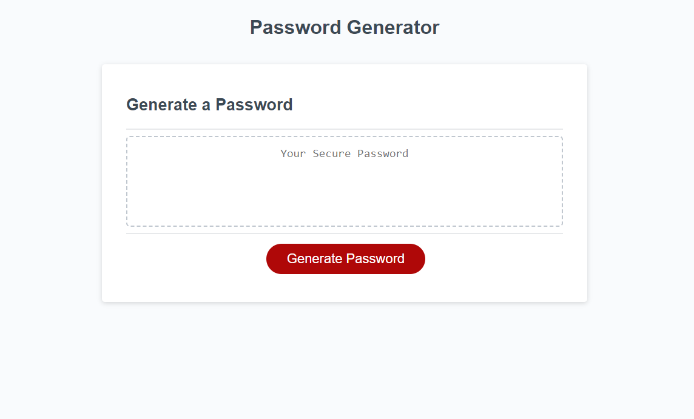

# Password Generator with JavaScript

## Description

This generator serves as a convenient way to create a strong password to keep online accounts safe. It can generate as many passwords
as needed and with the desired conditions met, such as the type of characters to be used. This generator is powered by JavaScript.

## Installation

N/A

## Usage

To get started, go to (link). To generate a password, click on the red 'Generate Password' button at the bottom of the text box. You will be presented
with five questions to set the conditions of your choice, including password length and the option to include or exclude numbers, special characters, uppercase, or lowercase
letters. After answering all questions, your generated password will appeared in the text box with dashed borders. From here you can copy and paste your new password as needed.
To generate another one, click on the red button again and follow the same process. You can create as many passwords as needed.

## Credits

N/A

## License

None